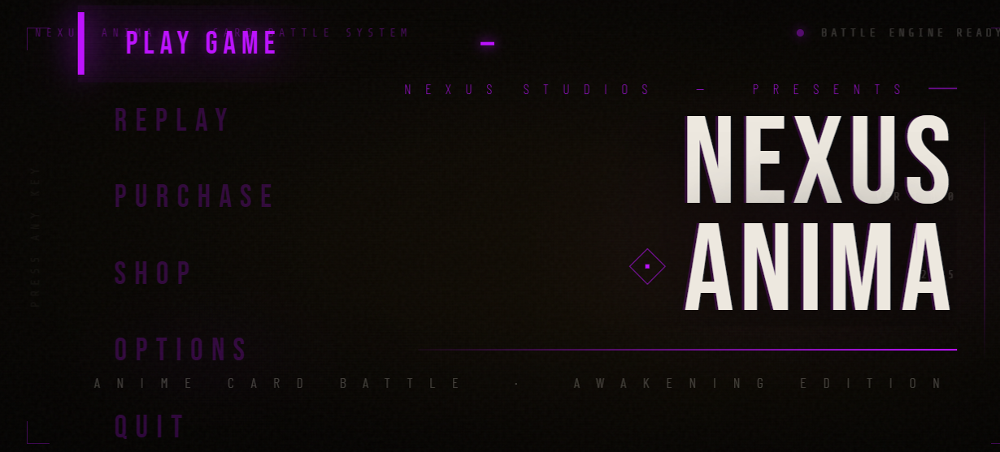
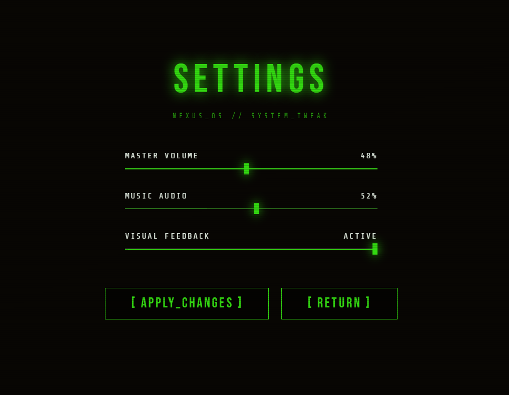
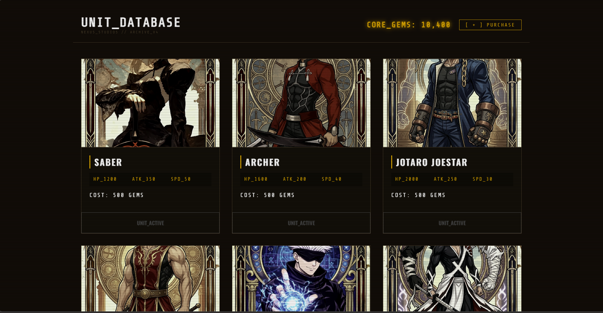
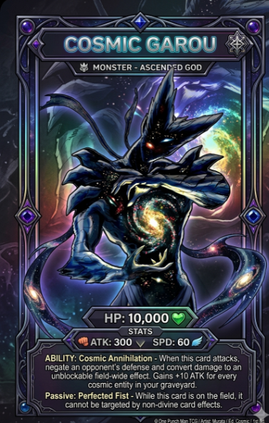

# Web Card Battle Game

A web-based anime-inspired card battle game developed using HTML, CSS, and JavaScript.  
Players can battle using powerful character cards with unique abilities and interactive gameplay mechanics.

---

## Features

- Anime-style card battle system
- Character cards with unique stats
- Interactive battle gameplay
- Store system
- Settings menu
- Sound effects and background music
- Responsive and modern UI

---

## Tech Stack

- HTML
- CSS
- JavaScript

---

## Folder Structure

```bash
web-card-battle-game/
│
├── game.html
├── about.html
├── style.css
├── script.js
│
├── assets/
│   ├── aizen.png
│   ├── archer.png
│   ├── gojo.png
│   ├── frieza.png
│   ├── bgm.mp3
│   └── more assets...
│
├── screenshot/
│   ├── playgame.png
│   ├── setting.png
│   ├── store.png
│   └── villiancard.png
│
└── README.md
```

---

## Screenshots

### Play Game


### Settings Menu


### Store System


### Villain Cards


---

## How to Run

1. Download or clone the repository
2. Open the project folder
3. Run `game.html` in your browser

---

## Future Improvements

- Multiplayer battles
- AI enemy system
- More anime characters
- Better battle animations
- Mobile optimization
- Online leaderboard

---

## Learning Objectives

This project was built to improve:
- Front-end web development
- JavaScript game logic
- UI/UX design
- GitHub project management

---

## Author

Vishu Singh

GitHub: https://github.com/Vishu-coding
